Compte Rendu — TP Injection des Dépendances 

Structure du projet
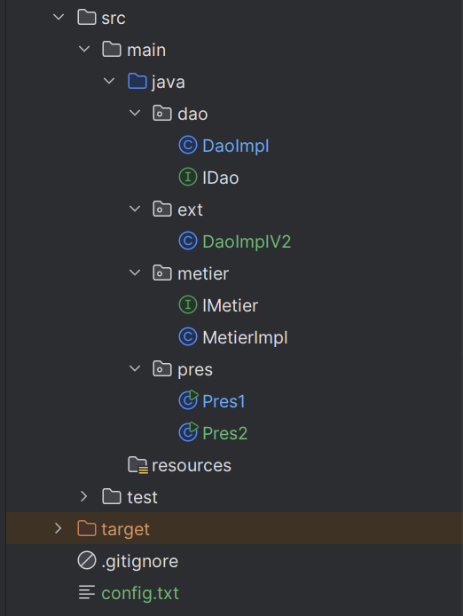

Étape 1 — Création de l’interface IDao

L’interface IDao définit la méthode getData() qui doit être implémentée par les classes de la couche DAO (accès aux données).

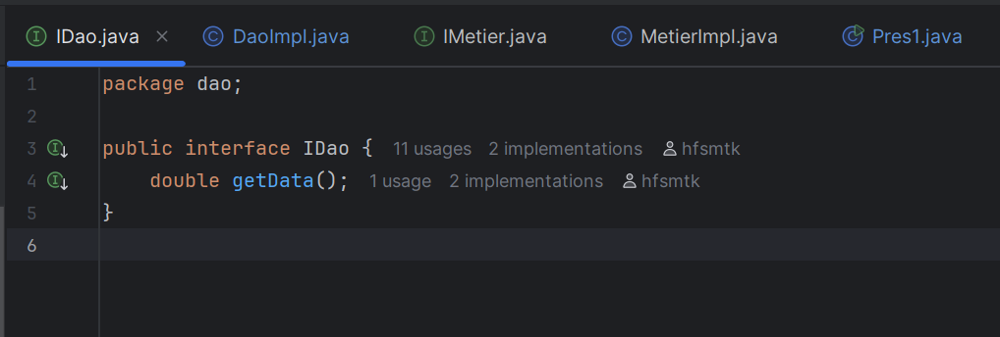

Étape 2 — Implémentation de l’interface IDao

La classe DaoImpl implémente l’interface IDao.
Elle simule la récupération d’une donnée
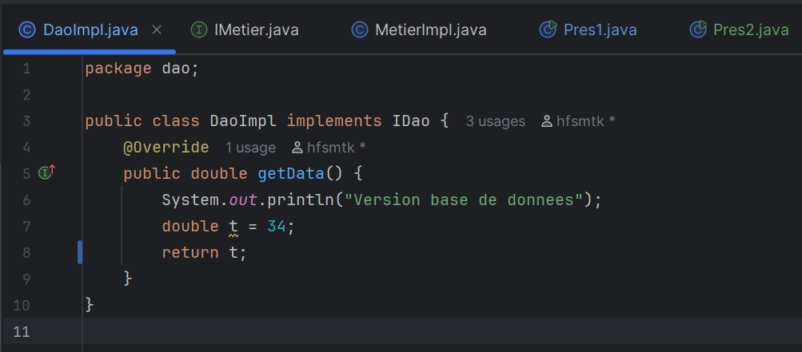

Une deuxième version DaoImplV2 a été créée dans le package ext, pour simuler une autre source de données (ex : capteurs).
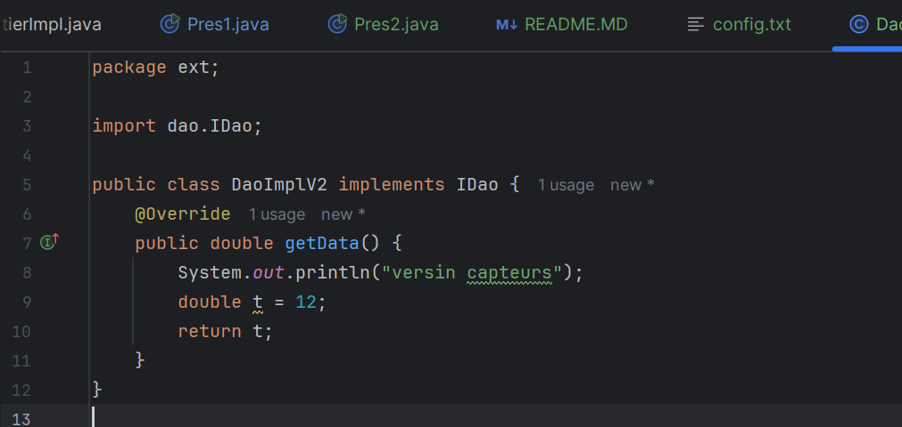

Étape 3 — Création de l’interface IMetier

L’interface IMetier définit la méthode calcul() qui représentera la logique métier de notre application.
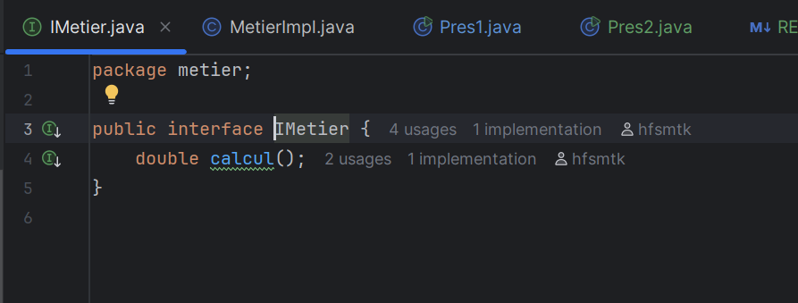

Étape 4 — Implémentation de la classe MetierImpl

La classe MetierImpl dépend de IDao pour obtenir les données nécessaires au calcul.
On injecte donc IDao soit par constructeur, soit par un setter (pour un couplage faible).
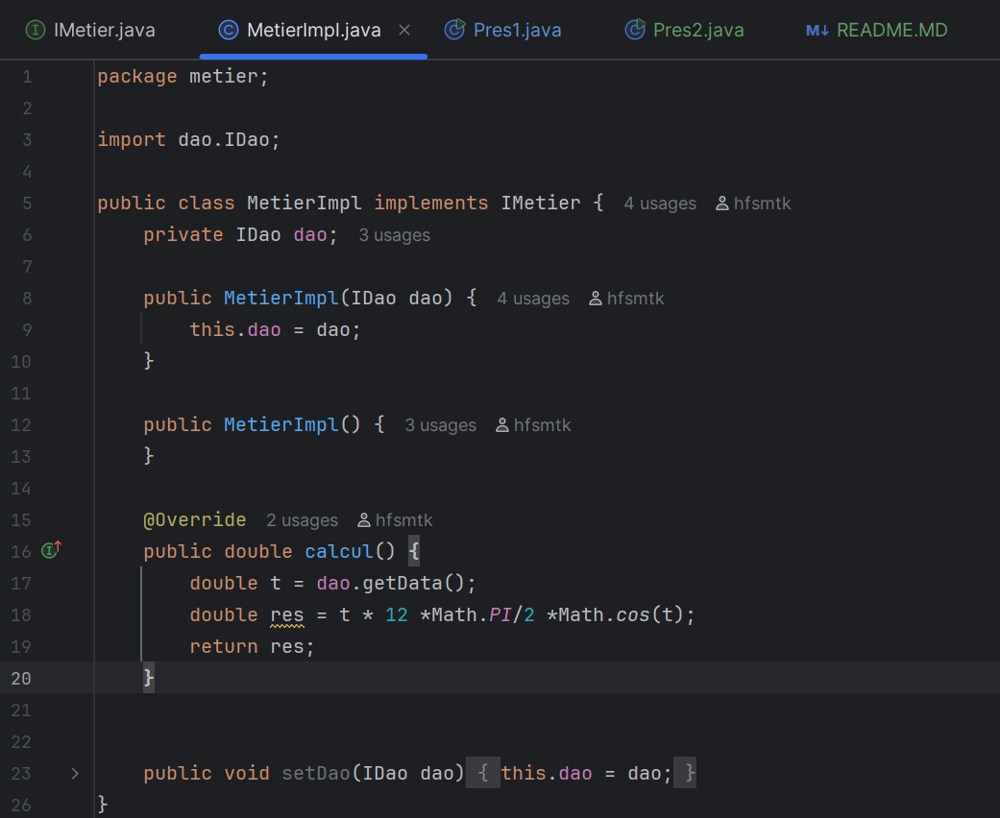
Le calcul dépend du résultat retourné par le DAO, mais MetierImpl ne sait pas quelle implémentation de IDao est utilisée → Couplage faible.

Étape 5 — Injection des dépendances

a. Par instanciation statique

Dans cette première approche, nous créons directement les instances dans le code (fortement typé mais simple).
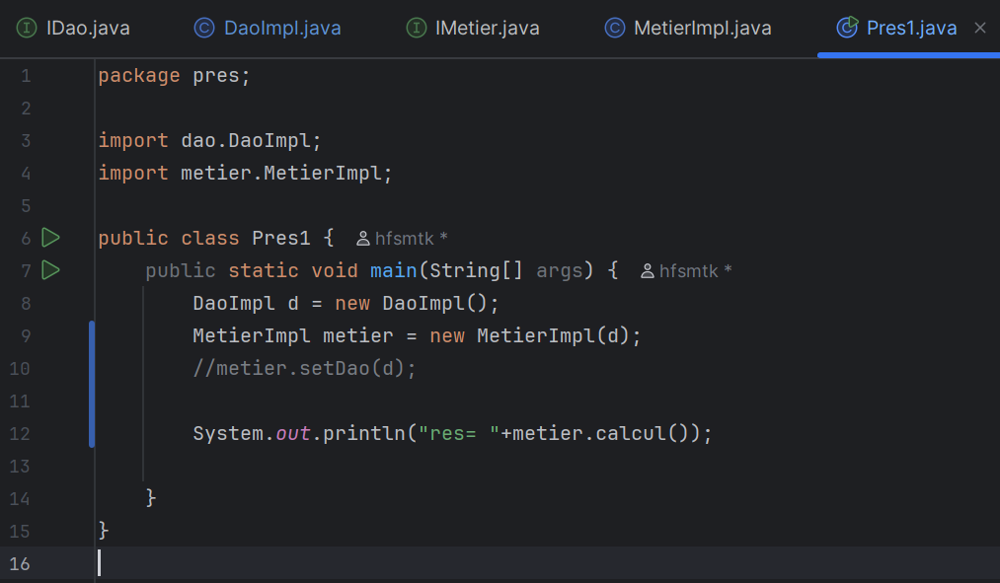

b. Par instanciation dynamique 

Ici, nous lisons les noms de classes à partir d’un fichier config.txt,
puis nous les chargeons dynamiquement avec Class.forName().
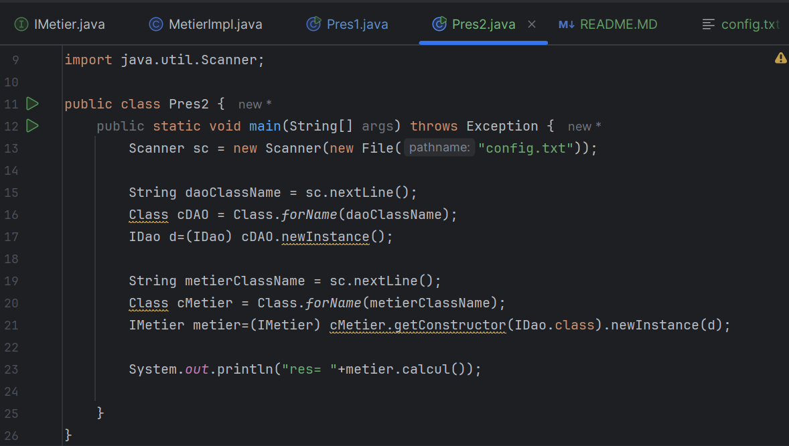
Fichier config.txt :
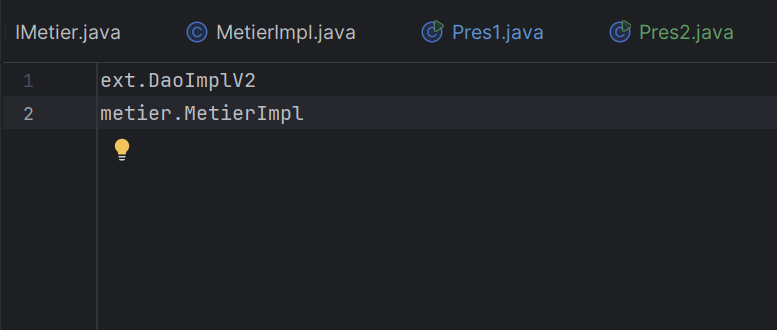
Ici, il suffit de changer la première ligne du fichier config.txt pour utiliser une autre version du DAO sans modifier le code Java.

Résultat final:

Lorsque config.txt contient dao.DaoImpl → message "Version base de données"

Lorsque config.txt contient ext.DaoImplV2 → message "Version capteurs"

Le calcul est exécuté par MetierImpl sans qu’il connaisse la source des données.

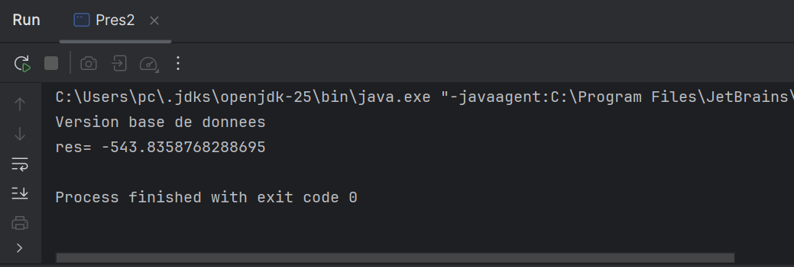

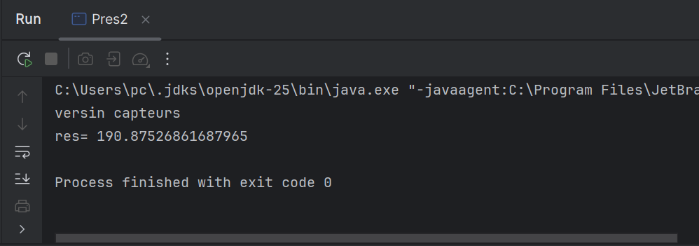

Alors cette application est maintenant ouverte à l’extension mais fermée à la modification.

c. Injection de dépendances avec Spring Framework
Version XML (PresSpringXML):

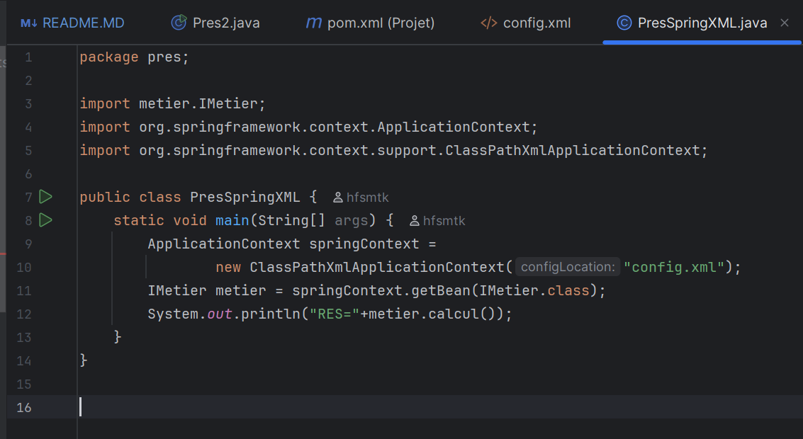

config.xml :

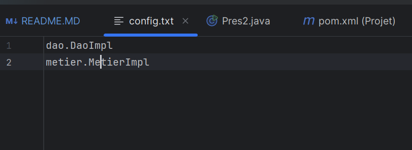
Spring crée les objets et gère leurs dépendances automatiquement.

Version Annotations (PresSpringAnnotation)

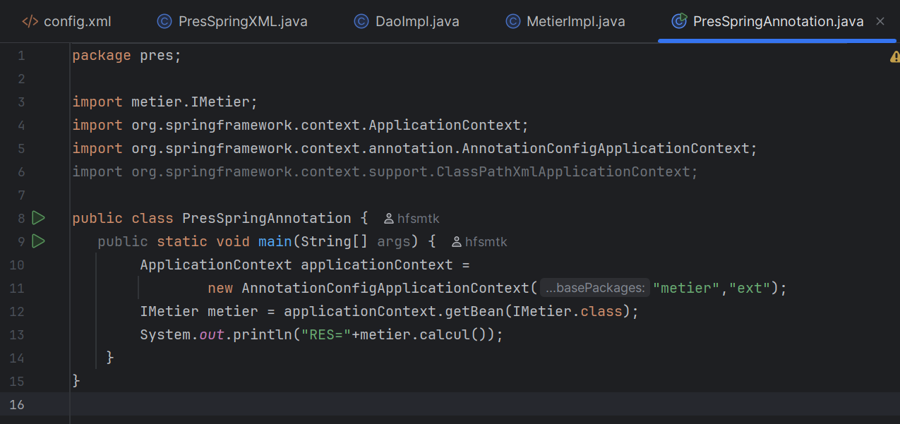

Dans ce cas, les classes MetierImpl ,DaoImpl et DaoImplV2 doivent être annotées avec @Component et l’injection se fait via @Autowired.

**Ce projet applique le principe de couplage faible :**

L’application est fermée à la modification mais ouverte à l’extension.

Le code de MetierImpl ne change pas lorsque l’on ajoute un nouveau DaoImpl.

On peut simplement ajouter de nouvelles classes DAO et modifier la configuration pour les utiliser.

Cela rend l’application extensible, maintenable et réutilisable.